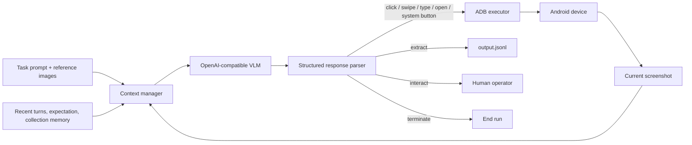

# crawler-agent

`crawler-agent` is an experimental, GUI-based data-collection agent for Android. Give it a natural-language task specification and an OpenAI-compatible vision-language model (VLM); it observes the phone through screenshots, decides one action at a time, operates the device through ADB, and appends extracted records to JSONL.

The project is aimed at data that is difficult or expensive to collect through websites, public APIs, packet capture, or reverse engineering—especially information that exists only inside mobile apps.

> **Project stage:** pilot / MVP. The core Android runtime is usable, but evaluation infrastructure, large-scale scheduling, browser support, and a non-technical task-development UI are roadmap items rather than finished product features.

For a detailed Chinese macOS setup guide, see [QUICK_START_Non_TECH_MACOS_zh.md](QUICK_START_Non_TECH_MACOS_zh.md).

## Why a crawler agent?

Traditional GUI automation usually follows a mostly predefined workflow: open a page, fill a form, submit it, and stop. That resembles traversing a directed path or DAG.

Data collection is different. A crawler must repeatedly discover items, enter detail pages, extract data, return to a list, avoid duplicates, recover from unexpected UI states, scroll for unseen items, and decide when coverage is sufficient. That is closer to traversing a branching tree than completing one fixed workflow.

This distinction matters on mobile. Login prompts, upgrade dialogs, coupons, advertisements, slow-network errors, permissions, layout changes, and app releases continually create states that were not represented in the original automation script. `crawler-agent` uses the visual understanding and generalization of a VLM to handle these variations while keeping the device-control runtime small and inspectable.

### Positioning relative to coding agents

Coding agents are optimized to solve problems using files, shell commands, APIs, code generation, and tests. They can operate a phone when given ADB or computer-use tools, but that is not their primary execution model and they may switch to code, logs, or UI-hierarchy inspection when a visual action fails.

`crawler-agent` deliberately constrains the loop around the mobile GUI: screenshot in, one structured action out. It is intended for repeatable collection tasks that run more often than a one-off coding-agent session but do not yet justify months of app-specific reverse engineering.

## Current capabilities

- **Screenshot-first Android control:** captures the original-resolution screen and executes actions through ADB. The main runtime does not depend on accessibility-tree or app-internal access.
- **OpenAI-compatible multimodal models:** supports configurable chat-completions endpoints, streaming and non-streaming responses, reasoning traces, retries, and common generation settings.
- **PreAct-style prediction and verification:** every model turn compares the previous action's expected result with the current screenshot before choosing the next action.
- **Strict GUI action protocol:** validates `<tool_call>` responses and uses a normalized `0–1000` coordinate space, then scales actions to the connected device's real resolution.
- **Crawler-native extraction:** `extract` writes incremental JSONL records without ending the task; `terminate` ends it explicitly.
- **Lightweight collection memory:** recent extracted item identities are returned to the model so it can prefer unseen results.
- **Duplicate suppression:** direct note records and cumulative `notes` arrays are de-duplicated by normalized author and title/text identity before being appended.
- **Multimodal task specifications:** task Markdown can interleave instructions with local reference images, such as annotated examples of search buttons or detail-page fields.
- **Human handoff:** `interact` pauses the loop for login, CAPTCHA, or another step that needs an operator.
- **Run observability:** each run records the terminal log, raw screenshots, action annotations, complete model request/response traces, and extracted JSONL.
- **Device preflight:** wakes the screen, attempts swipe-unlock, and returns to the default home page before a run.

## Pilot status and reported value

The two project presentations under [`repr/`](repr/) describe the project as a pilot that had completed MVP validation by mid-2026. They report:

- three demonstration tasks built around a Qwen3.5-397B model;
- a BYD flash-charge-station collection scenario used by the charging-network site-selection team;
- initial task development taking roughly one day rather than several weeks for comparable app-specific GUI automation;
- approximately **20× development efficiency**, **1/20 development cost**, and **less than ¥1 of model cost per run** in the reported pilot context.

These figures are project-reported pilot results, not reproducible benchmark results from the checked-in repository. Building a replayable, cross-model benchmark and scoring system is a current roadmap priority.

The checked-in task material currently consists of:

| Task | State in this repository |
| --- | --- |
| `tasks/xhs_search` | Runnable example with screenshot references and structured note extraction |
| `tasks/xhs_note_collection` | Runnable home-feed collection example targeting ten distinct notes |
| `tasks/byd_flash_charge` | Runner scaffold; the checked-in task prompt is still a placeholder |

## How it works



Each step performs this loop:

1. Capture the current device screenshot, unless the previous step was an `extract` feedback turn.
2. Build the VLM context from the system prompt, task prompt, recent screenshot/action history, previous expectation, and collection memory.
3. Send the original screenshot to the configured multimodal chat-completions endpoint.
4. Parse the required four-part response: expectation check, action summary, next-state expectation, and one `mobile_use` tool call.
5. Route `extract`, `interact`, and `terminate` to the runtime; otherwise scale coordinates and execute the action through ADB.
6. Save the action history and debugging artifacts, wait for the UI to settle, and repeat.

### PreAct response contract

The default prompt requires the model to predict the visible result of every action and check that prediction on the next screenshot:

```text
Expectation Check: fulfilled - The expected detail page is visible.
Action: Extract the visible note metadata.
Expectation: The page will remain unchanged after extraction.
<tool_call>
{"name": "mobile_use", "arguments": {"action": "extract", "data": {"note_title": "...", "author_name": "..."}}}
</tool_call>
```

This makes failed taps, delayed transitions, and unexpected dialogs visible inside the normal agent loop. The comparison is currently performed by the VLM; there is not yet an independent visual verifier.

### Default action space

| Action | Purpose | Main arguments |
| --- | --- | --- |
| `click` | Tap the screen | `coordinate: [x, y]` |
| `swipe` | Drag between two points | `coordinate`, `coordinate2` |
| `type` | Type into the focused field and press Enter | `text` |
| `system_button` | Press Android navigation/system keys | `button`: `Back`, `Home`, `Menu`, or `Enter` |
| `open` | Launch an app through its configured package alias | `text` |
| `extract` | Append structured data and continue crawling | `data` |
| `interact` | Pause for a human operator | `text` |
| `terminate` | End with an explicit outcome | `status`, `summary` |

Coordinates emitted by the model must be normalized to `0–1000` on both axes. The executor rejects out-of-range coordinates and maps valid coordinates to the device size reported by `adb shell wm size`. Screenshots are sent at their original resolution; model/backend image preprocessing and ADB coordinate execution are intentionally separate concerns.

## Getting started

### Requirements

- Python 3.10 or newer
- `adb` available on `PATH`
- one connected and authorized Android phone or emulator
- a vision-capable, OpenAI-compatible `/chat/completions` endpoint
- the target app installed and prepared for the task

The current CLI does not expose an ADB device selector, so keep only one target device connected while running a task.

### 1. Install dependencies

```bash
python3 -m venv .venv
source .venv/bin/activate
python -m pip install -r requirements.txt
```

Only `Pillow` and `requests` are required by the Python runtime.

### 2. Check the device

```bash
adb devices
adb shell wm size
```

The device should appear with status `device`, not `offline` or `unauthorized`. The preflight can wake and swipe-unlock a device, but it cannot enter a PIN, password, or biometric credential.

### 3. Configure the model

```bash
cp model_config.json.example model_config.json
```

Edit `model_config.json`:

```json
{
  "endpoint_url": "https://your-endpoint/v1/chat/completions",
  "api_key": "YOUR_API_KEY",
  "model_name": "YOUR_VISION_MODEL",
  "temperature": 0.2,
  "top_p": 0.7,
  "max_tokens": 1024,
  "frequency_penalty": 0,
  "presence_penalty": 0,
  "stream": false,
  "is_reasoning_model": false
}
```

`model_config.json` is ignored by Git. Do not commit credentials or copy them into task prompts and traces.

### 4. Run an included task

Start with the XHS search example:

```bash
bash tasks/xhs_search/run_task.sh
```

For a short smoke run, invoke the runner directly with a lower step limit:

```bash
python run_agent.py \
  --model-config model_config.json \
  --system-prompt-path system_prompt.md \
  --task-prompt-path tasks/xhs_search/task_prompt.md \
  --trace-dir tasks/xhs_search/traces/smoke \
  --max-steps 5 \
  --history-length 6
```

The full CLI is available through:

```bash
python run_agent.py --help
```

## Run artifacts

Task scripts create one timestamped directory per run:

```text
tasks/xhs_search/2026-06-24_15-30-00/
├── run_2026-06-24 15-30-00.log
├── output.jsonl
├── screenshot/
├── screenshot_anno/
└── llm-tracer/
```

- `run_*.log` mirrors stdout and stderr.
- `output.jsonl` contains one incremental record per accepted extraction.
- `screenshot/` contains the source image for each visual turn.
- `screenshot_anno/` marks executed clicks and swipes in device-pixel coordinates.
- `llm-tracer/` stores full request/response/error records for every model call.

Model traces contain screenshots, prompts, and model outputs. Treat the entire run directory as potentially sensitive.

## Creating a task

Create a self-contained directory under `tasks/`:

```text
tasks/your_task/
├── task_prompt.md
├── run_task.sh
└── assets/                 # optional local reference images
```

The task prompt should define:

1. the goal and starting app/page;
2. the navigation and traversal strategy;
3. the exact extraction schema and required fields;
4. duplicate/coverage rules and a clear completion condition;
5. safe recovery behavior and when to request human help;
6. forbidden or irreversible operations such as posting, liking, purchasing, payment, or settings changes.

Task prompts may embed local images with normal Markdown syntax:

```markdown
The circled control is the search button:


```

The loader resolves these paths relative to `task_prompt.md`, validates that each image can be opened, and inserts text and images into the VLM message in document order. Remote image URLs are intentionally rejected.

Copy an existing `run_task.sh`, point it at the new prompt, begin with `--max-steps 5`, and inspect the screenshots, annotations, log, and traces before increasing the run length. Change one variable at a time when comparing prompts or models.

## Repository structure

```text
crawler-agent/
├── run_agent.py                 # CLI, device preflight, and main loop
├── context_manager.py           # multimodal prompt, history, and collection memory
├── agent_io.py                  # ADB control, response parsing, extraction, scaling
├── llm_client.py                # OpenAI-compatible HTTP client and LLM traces
├── logs.py                      # per-run directories and tee logging
├── system_prompt.md             # default action protocol and recovery policy
├── app_name_to_package.py       # app-alias resolver
├── app_name_to_package.json     # package and localized-name mappings
├── model_config.json.example    # endpoint configuration template
├── tasks/                       # task prompts, assets, runners, generated runs
├── research_notes/              # resolved decisions and open investigations
├── repr/                        # project presentations and supporting images
├── scripts/                     # diagnostics and device-maintenance helpers
└── QUICK_START_Non_TECH_MACOS_zh.md
```

## Known limitations

- The runtime is Android-only and assumes a single connected ADB target.
- Observation is screenshot-based and synchronous. Short-lived dialogs or animations can disappear between model turns.
- Expectation checking is model-driven; there is no separate state-transition classifier or deterministic retry controller yet.
- Working memory is bounded chat history plus a small, task-shaped collection summary—not a general persistent memory system.
- Duplicate suppression is task-shaped and currently covers direct note records and `notes` arrays; it does not yet normalize every possible wrapper schema.
- Model output recovery can repair missing closing JSON brackets, but reasoning-only or otherwise malformed responses may still consume a turn or stop progress.
- Reliable non-ASCII text entry depends on ADB Keyboard or Android clipboard support; the final fallback is lossy for some characters.
- There is no scheduler, replay engine, benchmark scorer, browser executor, or desktop task-authoring workbench in the repository today.
- `tasks/byd_flash_charge/task_prompt.md` is a placeholder in the public tree.

See [`research_notes/`](research_notes/) for coordinate-scaling decisions, vLLM/GUI-Owl image-processing findings, state-drift cases, swipe feedback ideas, and unresolved inference-backend behavior.

## Roadmap

The project presentations identify the next six-month direction as:

1. Build an eval-driven task pool with replay, cross-model comparison, cross-device execution, and benchmark scoring.
2. Turn those evaluations into a harness/loop-engineering workflow where prompt, tool, model, and runtime changes are recorded and compared before adoption.
3. Improve small-model performance, targeting useful coverage from 7–9B models and partial routine-task coverage from 2B models.
4. Add browser use and unify phone/browser observation, actions, extraction, and task planning.
5. Build a desktop task-development and debugging workbench for prompt/spec authoring, device preview, trace review, diagnosis, and iteration.
6. Explore higher-frequency perception, stronger state reconciliation, and reusable visual/action/trajectory memory.

## External reference repositories

The ignored `.reference-repos/` directory contains shallow, read-only upstream clones used for architectural study:

- [anomalyco/opencode](https://github.com/anomalyco/opencode) — coding-agent loops, tool execution, sessions, and extensibility.
- [NousResearch/hermes-agent](https://github.com/NousResearch/hermes-agent) — persistent agents, memory, skills, tools, self-improvement, and background execution.
- [X-PLUG/MobileAgent](https://github.com/X-PLUG/MobileAgent) — mobile GUI-agent architecture, grounding, action schemas, memory, and benchmarks.
- [bytedance/UI-TARS](https://github.com/bytedance/UI-TARS) — GUI grounding, inference, action parsing, and evaluation.

These repositories are untrusted research inputs. Do not run their setup scripts, hooks, binaries, tests, or containers without reviewing them. Durable conclusions belong in `research_notes/`, with the inspected upstream revision and the ideas adopted or rejected.

## License

This repository is licensed under the [GNU General Public License v2.0](LICENSE).
