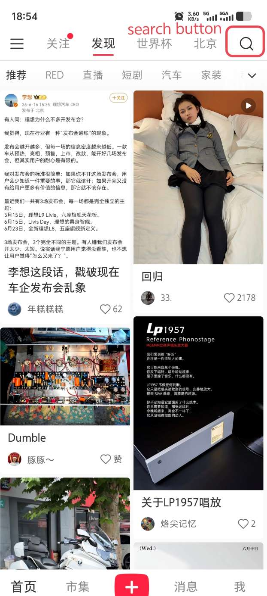

# XHS Search Note Collection Task

## Goal
Search for keyword `labubu` in 小红书 app , browse the search results, enter each relevant note detail page, extract the content of the page in structured JSON output, then go back to the search results and continue collecting more notes.

## Process:
1. Open the 小红书 app.
2. The image below shows the first screen after opening 小红书. The search button is circled in red at the top-right corner. Tap this circled search button to enter the search page:



3. On the search page, search for `labubu`.
4. On the search results screen, tap each relevant visible note card to enter its detail screen.
   - If tapping one visible note does not open its detail page after one retry, mark that note/card as unavailable for this run. Do not tap it again. Choose a different visible note, or scroll to reveal more notes.
5. If the current screenshot is a note detail page, the next tool call must be `action=extract`. OCR the current screenshot into structured JSON and put it into the tool-call `arguments.data` field.
6. The image below is an example note detail page from the search result. Use it as a reference for recognizing detail pages and extracting fields. The marked regions show where to find `author_name`, `note_text`, `note_title` on a detail page:


7. After extraction, use system button `back` or click the back button on the top left corner, to go back to the search results screen, then navigate to the next unseen detail screen.
8. Do not enter the same detail page twice, If you accidentally re-enter a note that was entered before, do not extract it again. Go back to the search results screen and continue to a different note.
9. If all the notes in the current search results screen have been seen, scroll down to reveal more notes.
10. Never keep trying the same card, same coordinate, or same failed navigation action. One retry is enough; after that, skip that target and keep collecting what can be collected.

## Extract Format:
For each note, the fields and their expected data types are shown in the JSON object below. Only `author_name` is required. All other fields are optional. Use `null` when a field is not visible. Do not invent data:

```json
{
  "task": "xhs_note_crawler",
  "app": "XHS",
  "note_detail": {
    "note_title": null,
    "author_name": null,
    "publish_time": null,
    "like_count": null,
    "collect_count": null,
    "comment_count": null,
    "note_text": null,
    "tags": [],
    "location": null,
    "images_count": null,
    "is_video": false,
    "notes": null
  }
}
```

## Completion:
- When all the search results are collected, end the task by emit `terminate` action.You should see "- 无更多内容 - " in the end of the scrollable page, or the page is not moving when you swipe, 

## Exception Handling
If the UI becomes stuck in a way you cannot overcome safely, use `action=interact` to call human being for help.

If the app asks for a non-destructive permission, such as notifications, allow it once and continue.

If there is pop-up, advertisement or asking for upgrade or coupon or anything irrelavent to the task, just close it.

If the previous expectation is not fulfilled and the previous action has already been retried once, do not repeat the same action again. Continue with another visible note, scroll for more results, or terminate successfully with the items collected so far if no further progress is possible.
